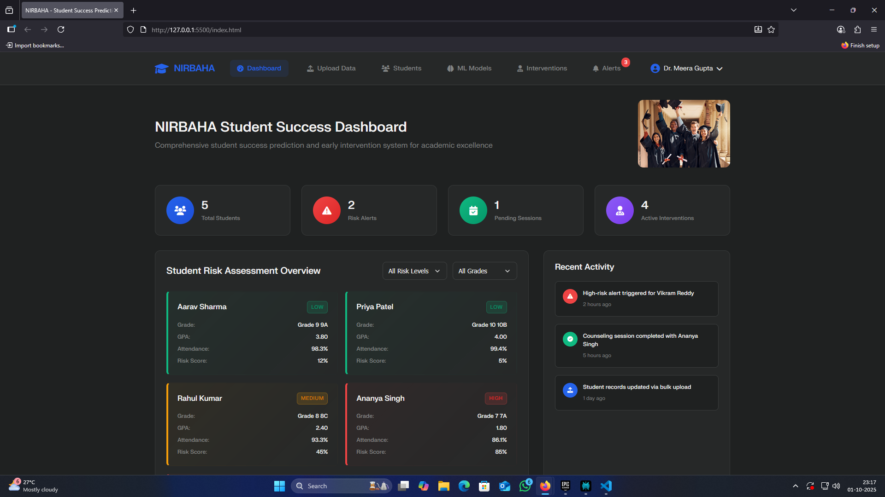
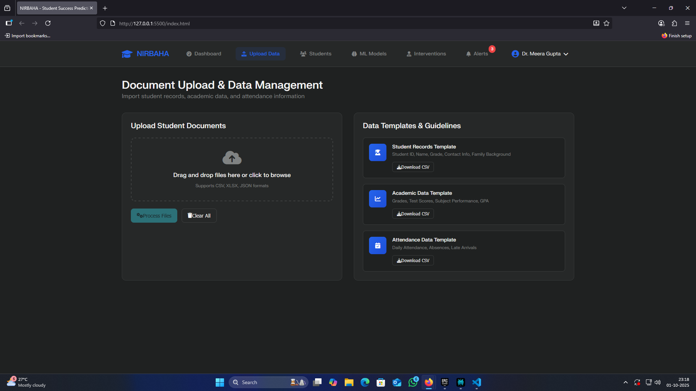
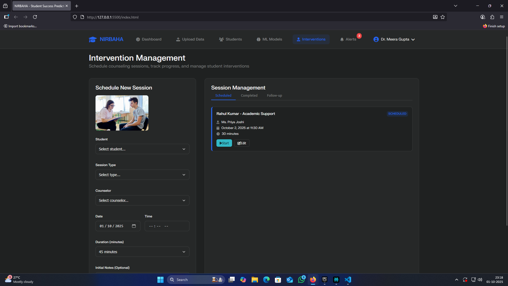
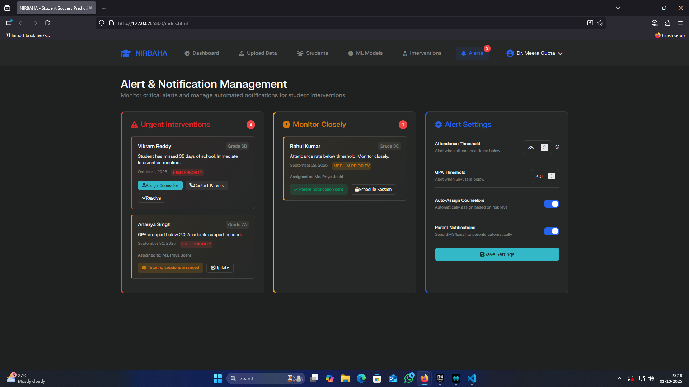

# NIRBAHA – Student Success Prediction & Early Intervention 🚀

**Ever wondered if technology and education can work hand in hand to catch struggling students before they slip through the cracks?**  
With NIRBAHA, you get more than just analytics: you get a complete, user-centric platform built to identify at-risk students, track interventions, and empower educators to make a real difference – all in one elegant dashboard!


## ✨ What Makes NIRBAHA Special?

- **No-nonsense Predictive Power:** Machine learning models process attendance, grades, and behavioral patterns to surface students who need help *now*, not later.
- **One-Stop Management:** Drag-and-drop data upload, template support, student profiles, risk reasons, counselor scheduling, and alert management.  
- **For Educators, By Developers:** Crafted for real-world school counselors and teachers, with zero AI jargon and full control over your data and actions.
- **Human Touch:** Every intervention, alert, and note is logged, so every student is seen as an individual, not just a data point.

---

## 🌟 Features at a Glance



- **Beautiful Dashboard**: Instantly see risk levels for your entire student body.
- **Drag-and-Drop Data Upload**: Import CSV, XLSX, or JSON with clear templates for student profiles, academics, and attendance.
- **ML Model Selection**: View and use different machine learning models for risk prediction.
- **Seamless Intervention Scheduling**: Assign and track counseling sessions, family meetings, or academic support.
- **Real-time Alerts**: Immediate notifications for urgent and priority cases.
- **Audit Trail**: Every major action is logged for transparency and follow-up.

---

## 📸 Screenshots

**Document Upload & Data Management**  
> 

Easy drag-and-drop upload interface with downloadable templates and instant feedback.

---

**Intervention Management**  
> 

Schedule new interventions, track all sessions, and see outcomes at a glance.

---

**Alert & Notification Management**  
> 

Triage urgent cases, monitor moderate risks, and keep parents/guardians informed.

---

## 🚀 How To Run NIRBAHA Locally - The Fast Way

1. **Extract all files** into a single project folder.
2. **Open that folder** in VS Code (or your favorite code editor).

### Option 1: Quick Start (Recommended for all features)

In VS Code, open the terminal and run:

If you have Python 3 installed
```bash
python -m http.server 8000
```
Now, go to [http://localhost:8000](http://localhost:8000) in your browser.

**Tip:** You can also use the VS Code “Live Server” extension (right-click `index.html` → “Open with Live Server”) for auto-reload when editing.

### Option 2: Open HTML Directly  
Just double-click `index.html` and open in your browser.  
(But: For best experience with uploads and navigation, use a local server as above!)

---

## 📚 Learning Outcomes & Project Impact

- **See end-to-end project flow:** From data collection to risk prediction, and hands-on intervention management.
- **Experiment with real ML models:** Swap between classifiers and see the impact in your real data.
- **Understand educational intervention:** This tool is a showcase for how data science can support school administrators and counselors in real-time.
- **Impress in your portfolio:** Show off live screenshots, hands-on interfaces, and a real solution to real educational problems.

---

## 📦 Technologies Used

- HTML5 | CSS3 | Vanilla JavaScript (ES6+)
- Chart.js (for any visualizations)
- Font Awesome Icons
- Python (for optional local server)
- Designed for real-world educators – not just for demos!

---

## 💡 Who Is This For?

- School administrators and counselors wanting proactive student support
- Educators interested in real-world applications of data science
- Developers and students building their portfolios or seeking to make a social impact

---

## 💬 Questions or Suggestions?

Open an issue, fork the project, or reach out – help and collaboration are welcome!

---

**NIRBAHA – Predict. Act. Empower. Succeed.**  
*Making education smarter, one student at a time.*

---

> _“With NIRBAHA, every student counts – and every risk gets the attention it deserves.”_
